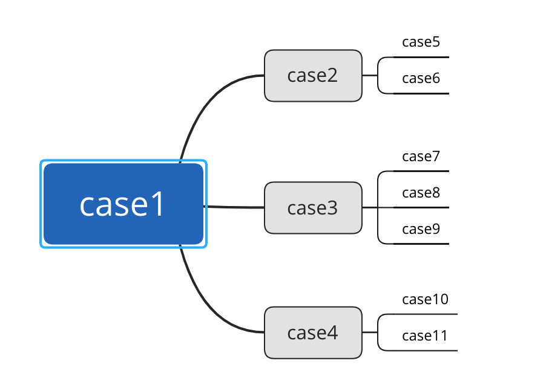
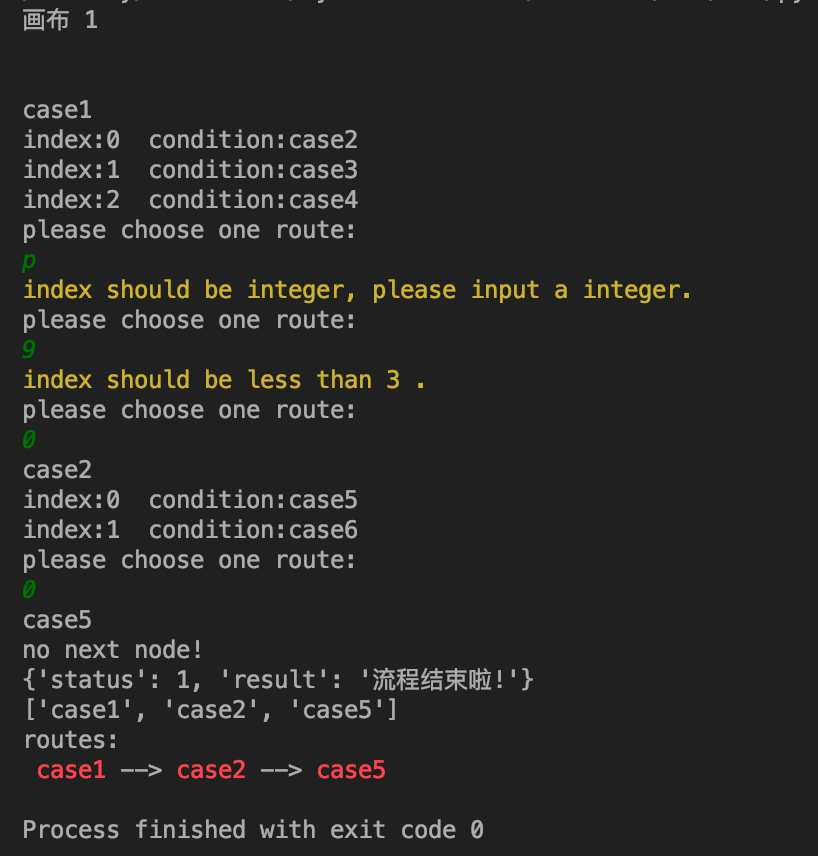
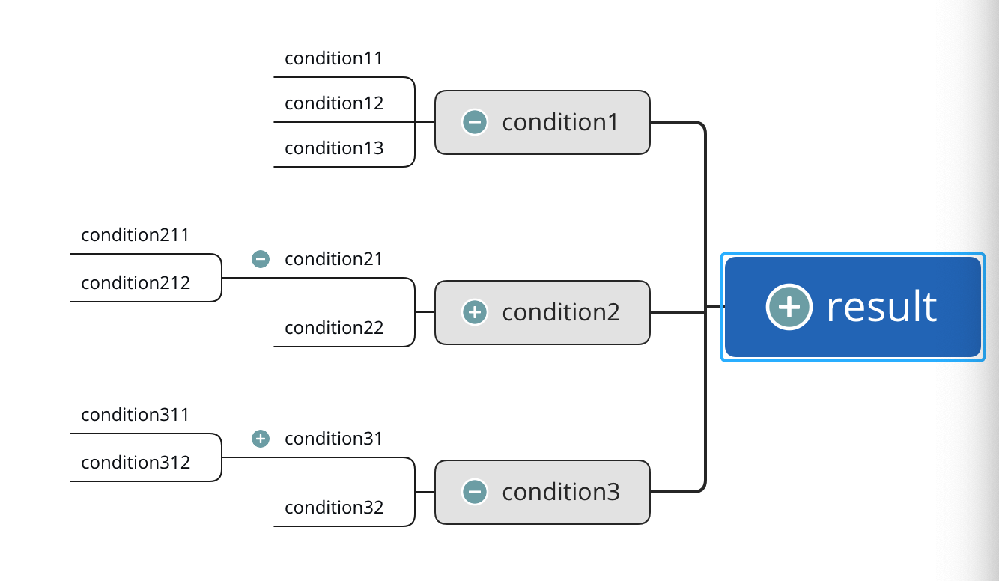
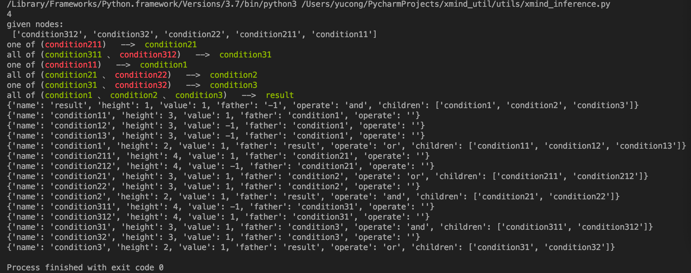

# 说明

## xmind_util

见文件： `xmind_utils.py`

### 读写

安装 pip3 install xmind

### xmind 层次结构的路径

xmind 结构为：



执行 `xmind_route("./files/demo.xmind")` ,选择的路径 为 **case1** --> **case2** --> **case5** 结果如下：




### xmind 推理逻辑

在这里，假定 图标 **+** 表示 **and** 操作（且）； 图标 **—** 表示 **or** 操作（与）

xmind 结构为：


转化为 node 的中间结果 见 **files/operate_nodes.json**

测试：
```
xmind_inference("./files/operate.xmind",
                ["condition312", "condition32", "condition22", "condition211", "condition11"])
```

推理路径图 与 结果 如下：



- 红色节点 为 事先给定的节点
- 绿色节点 为 推理出来的节点


